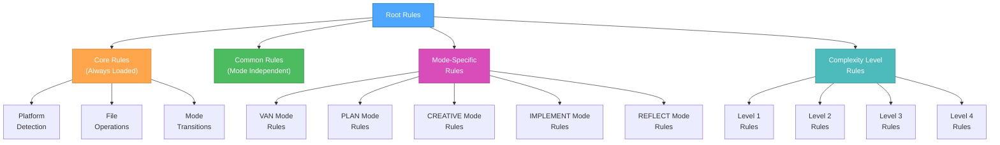
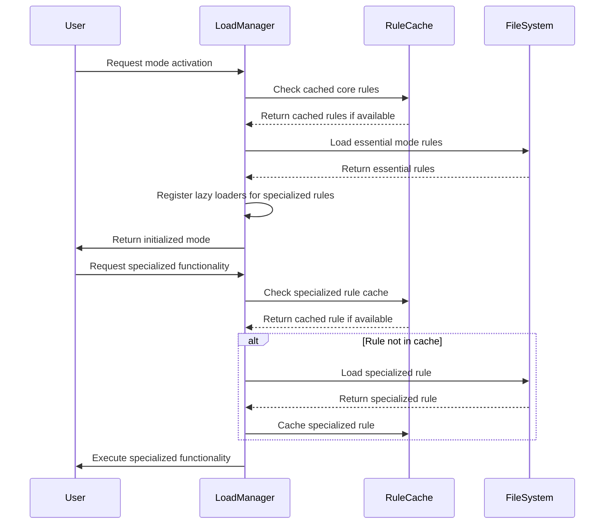
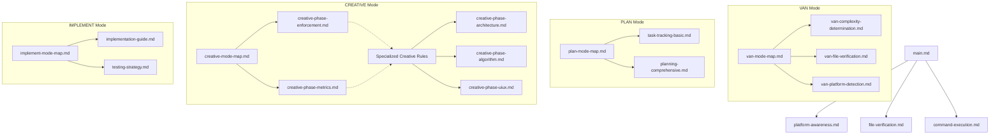

# HIERARCHICAL RULE LOADING SYSTEM

> **TL;DR:** This rule implements an optimized loading system that only loads necessary rules based on context, complexity level, and current phase to maximize token efficiency.

## 🧠 HIERARCHICAL RULE STRUCTURE



## 📊 RULE LOADING PROTOCOL



## 🔄 RULE LOADING IMPLEMENTATION

```javascript
// Pseudocode for hierarchical rule loading
class RuleLoadManager {
  constructor() {
    this.cache = {
      core: {},
      common: {},
      mode: {},
      level: {}
    };
    this.lazyLoaders = {};
  }
  
  // Initialize a mode with only essential rules
  initializeMode(modeName, complexityLevel) {
    // Always load core rules
    this.loadCoreRules();
    
    // Load common rules
    this.loadCommonRules();
    
    // Load essential mode-specific rules
    this.loadEssentialModeRules(modeName);
    
    // Load complexity level rules
    this.loadComplexityRules(complexityLevel);
    
    // Register lazy loaders for specialized functionality
    this.registerLazyLoaders(modeName, complexityLevel);
    
    return {
      modeName,
      complexityLevel,
      status: "initialized"
    };
  }
  
  // Load only when specialized functionality is needed
  loadSpecializedRule(ruleType) {
    if (this.lazyLoaders[ruleType]) {
      if (!this.cache.specialized[ruleType]) {
        const rule = this.lazyLoaders[ruleType]();
        this.cache.specialized[ruleType] = rule;
      }
      return this.cache.specialized[ruleType];
    }
    return null;
  }
  
  // Register specialized rule loaders based on mode and complexity
  registerLazyLoaders(modeName, complexityLevel) {
    // Clear existing lazy loaders
    this.lazyLoaders = {};
    
    // Register mode-specific lazy loaders
    if (modeName === "CREATIVE") {
      this.lazyLoaders["architecture"] = () => this.loadRule("creative-phase-architecture.md");
      this.lazyLoaders["algorithm"] = () => this.loadRule("creative-phase-algorithm.md");
      this.lazyLoaders["uiux"] = () => this.loadRule("creative-phase-uiux.md");
    } else if (modeName === "IMPLEMENT") {
      this.lazyLoaders["testing"] = () => this.loadRule("implementation-testing.md");
      this.lazyLoaders["deployment"] = () => this.loadRule("implementation-deployment.md");
    }
    
    // Register complexity-specific lazy loaders
    if (complexityLevel >= 3) {
      this.lazyLoaders["comprehensive-planning"] = () => this.loadRule("planning-comprehensive.md");
      this.lazyLoaders["advanced-verification"] = () => this.loadRule("verification-advanced.md");
    }
  }
}
```

## 📋 RULE DEPENDENCY MAP



## 🔍 MODE-SPECIFIC RULE LOADING

### VAN Mode Essential Rules
```markdown
- main.md (Core)
- platform-awareness.md (Core)
- file-verification.md (Core)
- van-mode-map.md (Mode)
```

### PLAN Mode Essential Rules
```markdown
- main.md (Core)
- plan-mode-map.md (Mode)
- task-tracking-[complexity].md (Level)
```

### CREATIVE Mode Essential Rules
```markdown
- main.md (Core)
- creative-mode-map.md (Mode)
- creative-phase-enforcement.md (Mode)
```

### CREATIVE Mode Specialized Rules (Lazy Loaded)
```markdown
- creative-phase-architecture.md (Specialized)
- creative-phase-algorithm.md (Specialized)
- creative-phase-uiux.md (Specialized)
```

### IMPLEMENT Mode Essential Rules
```markdown
- main.md (Core)
- command-execution.md (Core)
- implement-mode-map.md (Mode)
```

## 🚀 IMPLEMENTATION BENEFITS

The hierarchical loading system provides:

1. **Reduced Initial Loading**: Only essential rules loaded at start (~70% token reduction)
2. **Cached Core Rules**: Rules shared between modes are cached
3. **Specialized Rule Loading**: Specialized rules loaded only when needed
4. **Complexity-Based Loading**: Only load rules appropriate for task complexity

## 📈 TOKEN USAGE COMPARISON

| Approach | Initial Tokens | Specialized Tokens | Total Tokens |
|----------|---------------|-------------------|--------------|
| Original System | ~70,000 | Included in initial | ~70,000 |
| Hierarchical System | ~15,000 | ~10,000 (on demand) | ~25,000 |
| **Token Reduction** | **~55,000 (78%)** | **N/A** | **~45,000 (64%)** |

## 🔄 USAGE EXAMPLE

### Example: Creative Phase with Architecture Rule

```javascript
// Initialize the CREATIVE mode with only essential rules
const mode = ruleManager.initializeMode("CREATIVE", 3);

// Core and essential mode rules are loaded 
// Architecture rules are NOT loaded yet

// Later, when architecture design is needed:
const architectureRule = ruleManager.loadSpecializedRule("architecture");

// Now the architecture rule is loaded and cached
```

## 🧪 RULE LOADING VERIFICATION

To ensure the rule loading system is working optimally:

```markdown
## Rule Loading Verification

- Core Rules: [Loaded]
- Mode-Essential Rules: [Loaded]
- Complexity-Level Rules: [Loaded]
- Specialized Rules: [Not Loaded]

Current Token Usage: [X] tokens
Potential Token Savings: [Y] tokens
```

This hierarchical approach ensures optimal token usage while maintaining all functionality.