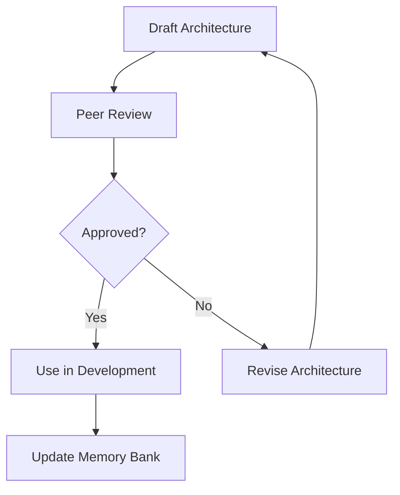

# MEMORY BANK ARCHITECTURE DOCUMENTATION (arc42)

## Overview
Architecture documentation follows the arc42 template structure, providing comprehensive system documentation at multiple levels:

* **System Context** – describes the system's environment, external interfaces, and stakeholders (arc42 Section 3)
* **Building Block View** – shows the system's internal structure and components (arc42 Section 5)

Both documentation levels help coordinate planning and design following established architecture documentation standards.
Record each architecture document's file path in `tasks.md` so every workflow phase can load the appropriate documentation.

## 📁 Architecture Documentation Template
| Field | Description |
|-------|-------------|
| **System Name** | Name of the system or capability |
| **Purpose** | What this system does (arc42 Section 1) |
| **Stakeholders** | Who is involved with this system (arc42 Section 2) |
| **System Context** | Business and technical context (arc42 Section 3) |
| **Solution Strategy** | Key decisions and approaches (arc42 Section 4) |
| **Building Blocks** | System components and structure (arc42 Section 5) |
| **Interfaces** | External and internal interfaces (arc42 Section 6) |
| **Quality Scenarios** | Quality requirements (arc42 Section 10) |
| **Diagram** | Mermaid diagram code describing the architecture |
| **Notes** | Additional context and decisions |

Architecture documentation must be defined using Mermaid so diagrams can be stored directly in the repository and versioned like other documents.

Building Block Views expand components into explicit sub-components and show their relationships and interfaces.

## 🗓️ Documentation Lifecycle

## 🗂️ Storage Conventions
Store the System Context under `memory-bank/architecture/system-context.md`.
Store the Building Block View under `memory-bank/architecture/building-blocks.md`.
Update `memory-bank/architecture/index.md` on every addition.

## 💡 Checklist
* [ ] Architecture captures purpose and interfaces
* [ ] Diagrams included following arc42 structure
* [ ] Peer review finished
* [ ] Linked from relevant tasks
