# MEMORY BANK ARCHIVE MODE

Produce the final archive of the completed task after reflection. Consolidate documentation, update Memory Bank files, and reset context for the next task.

```mermaid
graph TD
    Start["🚀 START ARCHIVE MODE"] --> ReadDocs["📚 Read tasks.md, progress.md, reflection.md<br>.github/instructions/rules/isolation_rules/main.md"]

    %% Initialization
    ReadDocs --> VerifyReflect{"✅ Verify reflection.md<br>Exists & Complete?"}
    VerifyReflect -->|"No"| ReturnReflect["⛔ ERROR:<br>Complete Reflection First"]
    VerifyReflect -->|"Yes"| LoadArchiveMap["🗺️ Load Archive Map<br>.github/instructions/rules/isolation_rules/visual-maps/archive-mode-map.md"]
    LoadArchiveMap --> AssessLevel{"🧩 Determine Complexity Level"}
    AssessLevel --> LoadLevelRules["📚 Load Level-Specific<br>Archive Rules"]
    LoadLevelRules --> ArchiveProcess["📦 EXECUTE ARCHIVING PROCESS"]
    ArchiveProcess --> CreateArchiveDoc["📄 Create Archive Document<br>in docs/archive/"]
    CreateArchiveDoc --> UpdateTasks["📝 Update tasks.md<br>Mark Task COMPLETE"]
    UpdateTasks --> UpdateProgress["📈 Update progress.md<br>with Archive Link"]
    UpdateTasks --> UpdateActiveContext["🔄 Update activeContext.md<br>Reset for Next Task"]
    UpdateActiveContext --> ArchiveComplete["🏁 ARCHIVING COMPLETE"]
    ArchiveComplete --> SuggestNext["✅ Suggest VAN Mode<br>for Next Task"]

    %% Styling
    style Start fill:#d9b3ff,stroke:#b366ff,color:black
    style ReadDocs fill:#e6ccff,stroke:#d9b3ff,color:black
    style VerifyReflect fill:#ffa64d,stroke:#cc7a30,color:white
    style LoadArchiveMap fill:#a3dded,stroke:#4db8db,color:black
    style ArchiveProcess fill:#4da6ff,stroke:#0066cc,color:white
    style ArchiveComplete fill:#4da6ff,stroke:#0066cc,color:white
    style SuggestNext fill:#5fd94d,stroke:#3da336,color:white
    style ReturnReflect fill:#ff5555,stroke:#cc0000,color:white
```



## IMPLEMENTATION STEPS
### Step 1: READ MAIN RULE & CONTEXT FILES
```
read_file({
  target_file: ".github/instructions/rules/isolation_rules/main.md",
  should_read_entire_file: true
})

read_file({
  target_file: "tasks.md",
  should_read_entire_file: true
})

read_file({
  target_file: "progress.md",
  should_read_entire_file: true
})

read_file({
  target_file: "reflection.md",
  should_read_entire_file: true
})
```

### Step 2: LOAD ARCHIVE MODE MAP
```
read_file({
  target_file: ".github/instructions/rules/isolation_rules/visual-maps/archive-mode-map.md",
  should_read_entire_file: true
})
```

### Step 3: LOAD COMPLEXITY-SPECIFIC RULES (Based on tasks.md)
Example for Level 2:
```
read_file({
  target_file: ".github/instructions/rules/isolation_rules/Level2/archive-basic.md",
  should_read_entire_file: true
})
```
(Adjust paths for Level 1, 3, or 4 as needed)

## VERIFICATION CHECKLIST
✓ ARCHIVE VERIFICATION
- Reflection document reviewed? [YES/NO]
- Archive document created with all sections? [YES/NO]
- Archive document placed in correct location (docs/archive/)? [YES/NO]
- tasks.md marked as COMPLETED? [YES/NO]
- progress.md updated with archive reference? [YES/NO]
- activeContext.md updated for next task? [YES/NO]
- Creative phase documents archived (Level 3-4)? [YES/NO/NA]

→ If all YES: Archiving complete. Suggest VAN Mode for the next task.
→ If any NO: Guide user to complete missing archive elements.

### MODE TRANSITION
Entry: This mode is triggered from REFLECT mode after the user types `ARCHIVE NOW`.
Exit: After successful archiving, the system should suggest returning to VAN mode to start a new task.

### VALIDATION OPTIONS
- Generate the archive document from reflection.md.
- Update tasks.md, progress.md, and activeContext.md.
- Show the archive file location and name.

### VERIFICATION COMMITMENT
```
┌─────────────────────────────────────────────────────┐
│ I WILL verify reflection is complete before archiving.│
│ I WILL create the archive document and update        │
│ Memory Bank files.                                   │
│ I WILL maintain tasks.md as the single source of     │
│ truth for final task completion status.              │
└─────────────────────────────────────────────────────┘
```
