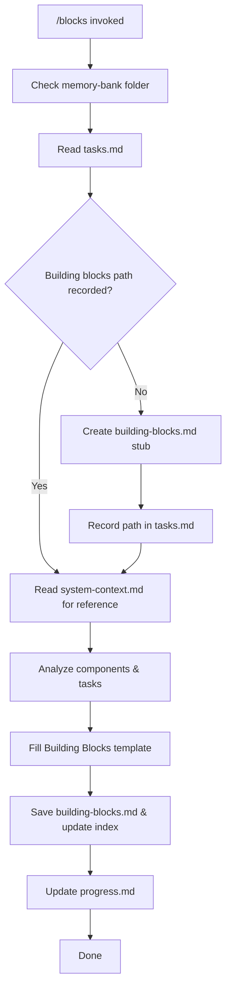

# MEMORY BANK BUILDING BLOCK VIEW PROMPT

Create or update a building block view document that details the system's internal structure and component relationships. Follow the arc42 template structure from `system-scheme-management.md`. Save it under `memory-bank/architecture/building-blocks.md`.

## Process Overview

