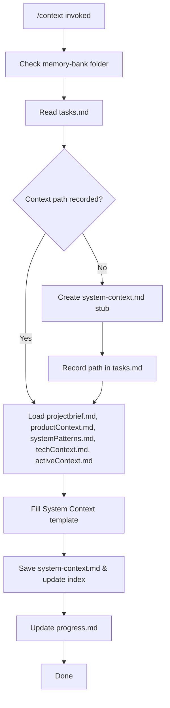

# MEMORY BANK SYSTEM CONTEXT PROMPT

Create or update a system context document that describes the system environment, external interfaces, and stakeholders. Follow the arc42 template structure from `system-scheme-management.md`. Save it under `memory-bank/architecture/system-context.md`.

## Process Overview

