# MEMORY BANK QA MODE

Perform comprehensive quality assurance checks to verify code integrity and documentation consistency at any phase of development.

Load the scenario and the referenced architecture documentation (System Context or Building Blocks) from `tasks.md` and ensure every acceptance criterion is validated.

```mermaid
graph TD
    Start["🚀 START QA MODE"] --> LoadMap["🗺️ Load QA Map<br>.github/instructions/rules/isolation_rules/visual-maps/qa-mode-map.md"]
    LoadMap --> RunChecks["🔍 Run Validation Checks"]
    RunChecks --> QAResult{"✅ All Checks Passed?"}
    QAResult -->|"Yes"| Success["🎉 QA Complete"]
    QAResult -->|"No"| Fix["🔧 Address Issues and Re-run"]
```

