# MEMORY BANK REFLECT MODE

Guide the review of the completed implementation and capture key lessons. Once the reflection is complete, prompt the user to type `ARCHIVE NOW` to initiate the Archive mode.

```mermaid
graph TD
    Start["🚀 START REFLECT MODE"] --> ReadDocs["📚 Read tasks.md, progress.md<br>.github/instructions/rules/isolation_rules/main.md"]

    %% Initialization
    ReadDocs --> VerifyImplement{"✅ Verify Implementation<br>Complete in tasks.md?"}
    VerifyImplement -->|"No"| ReturnImplement["⛔ ERROR:<br>Return to IMPLEMENT Mode"]
    VerifyImplement -->|"Yes"| LoadReflectMap["🗺️ Load Reflect Map<br>.github/instructions/rules/isolation_rules/visual-maps/reflect-mode-map.md"]
    LoadReflectMap --> AssessLevel{"🧩 Determine Complexity Level"}
    AssessLevel --> LoadLevelRules["📚 Load Level-Specific<br>Reflection Rules"]
    LoadLevelRules --> ReflectProcess["🤔 EXECUTE REFLECTION PROCESS"]
    ReflectProcess --> ReviewImpl["🔍 Review Implementation<br>& Compare to Plan"]
    ReviewImpl --> DocSuccess["👍 Document Successes"]
    DocSuccess --> DocChallenges["👎 Document Challenges"]
    DocChallenges --> DocLessons["💡 Document Lessons Learned"]
    DocLessons --> DocImprovements["📈 Document Process/<br>Technical Improvements"]
    DocImprovements --> UpdateTasks["📝 Update tasks.md<br>with Reflection Status"]
    UpdateTasks --> CreateReflectDoc["📄 Create reflection.md"]
    CreateReflectDoc --> ReflectComplete["🏁 REFLECTION COMPLETE"]
    ReflectComplete --> PromptArchive["💬 Prompt User:<br>Type `ARCHIVE NOW` to proceed"]

    %% Styling
    style Start fill:#d9b3ff,stroke:#b366ff,color:black
    style ReadDocs fill:#e6ccff,stroke:#d9b3ff,color:black
    style VerifyImplement fill:#ffa64d,stroke:#cc7a30,color:white
    style LoadReflectMap fill:#a3dded,stroke:#4db8db,color:black
    style ReflectProcess fill:#4dbb5f,stroke:#36873f,color:white
    style ReflectComplete fill:#4dbb5f,stroke:#36873f,color:white
    style PromptArchive fill:#f8d486,stroke:#e8b84d,color:black
    style ReturnImplement fill:#ff5555,stroke:#cc0000,color:white
```



## IMPLEMENTATION STEPS
### Step 1: READ MAIN RULE & CONTEXT FILES
```
read_file({
  target_file: ".github/instructions/rules/isolation_rules/main.md",
  should_read_entire_file: true
})

read_file({
  target_file: "tasks.md",
  should_read_entire_file: true
})

read_file({
  target_file: "progress.md",
  should_read_entire_file: true
})
```

### Step 2: LOAD REFLECT MODE MAP
```
read_file({
  target_file: ".github/instructions/rules/isolation_rules/visual-maps/reflect-mode-map.md",
  should_read_entire_file: true
})
```

### Step 3: LOAD COMPLEXITY-SPECIFIC RULES (Based on tasks.md)
Example for Level 2:
```
read_file({
  target_file: ".github/instructions/rules/isolation_rules/Level2/reflection-basic.md",
  should_read_entire_file: true
})
```
(Adjust paths for Level 1, 3, or 4 as needed)

## VERIFICATION CHECKLIST
✓ REFLECTION VERIFICATION
- Implementation thoroughly reviewed? [YES/NO]
- Successes documented? [YES/NO]
- Challenges documented? [YES/NO]
- Lessons Learned documented? [YES/NO]
- Process/Technical Improvements identified? [YES/NO]
- reflection.md created? [YES/NO]
- tasks.md updated with reflection status? [YES/NO]

→ If all YES: Reflection complete. Prompt user: "Type `ARCHIVE NOW` to proceed with archiving."
→ If any NO: Guide user to complete missing reflection elements.

### MODE TRANSITION
Entry: This mode is typically entered after IMPLEMENT mode completes.
Exit: After successful reflection, the user triggers ARCHIVE mode by typing `ARCHIVE NOW`.

### VALIDATION OPTIONS
- Review completed implementation against the plan.
- Generate reflection.md based on the review.
- Show updates to tasks.md.
- Prompt for the ARCHIVE NOW command when ready.

### VERIFICATION COMMITMENT
```
┌─────────────────────────────────────────────────────┐
│ I WILL guide the REFLECTION process.                │
│ I WILL prompt the user to type `ARCHIVE NOW`        │
│ when reflection is complete.                        │
│ I WILL maintain tasks.md as the single source of    │
│ truth for reflection status.                        │
└─────────────────────────────────────────────────────┘
```
